# Name : MADHESH I
# Reg No : 212224220055
# Windows-basic-commands-batchscript
Ex08-Windows-basic-commands-batchscript


# AIM:
To execute Windows basic commands and batch scripting

# DESIGN STEPS:

### Step 1:

Navigate to any Windows environment installed on the system or installed inside a virtual environment like virtual box/vmware 

### Step 2:

Write the Windows commands / batch file . Save each script in a file with a .bat extension. Ensure you have the necessary permissions to perform the operations. Adapt paths as needed based on your system configuration.
### Step 3:

Execute the necessary commands/batch file for the desired output. 


# WINDOWS COMMANDS:
## Exercise 1: Basic Directory and File Operations
Create a directory named "my-folder"

## COMMAND AND OUTPUT
```
mkdir my-folder
```
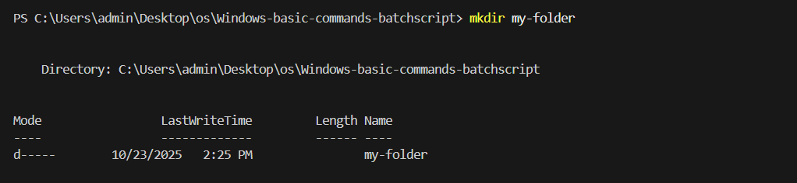

Remove the directory "my-folder"

## COMMAND AND OUTPUT
```
rmdir my-folder
```
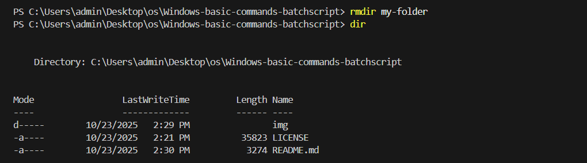

Create the file Rose.txt

## COMMAND AND OUTPUT
```
COPY CON Rose.txt
```
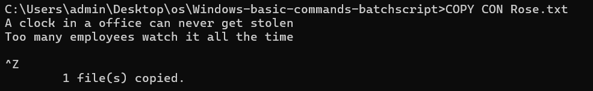


Create the file hello.txt using echo and redirection

## COMMAND AND OUTPUT
```
echo "hello,World" > hello.txt
type hello.txt
```
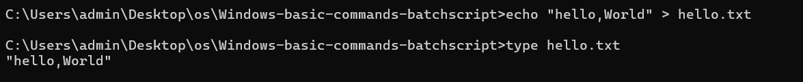

Copy the file hello.txt into the file hello1.txt

## COMMAND AND OUTPUT
```
copy hello.txt hello1.txt
```
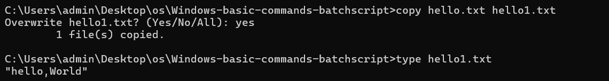

Remove the file hello1.txt

## COMMAND AND OUTPUT
```
del hello1.txt
```
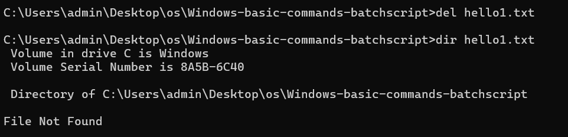

List out the file hello1.txt in the current directory

## COMMAND AND OUTPUT
```
dir hello1.txt
```
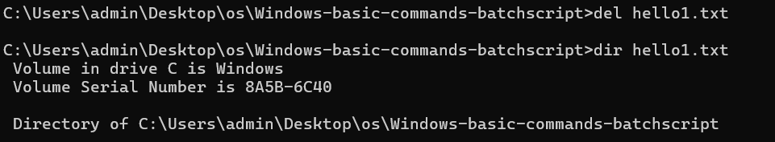

List out all the associated file extensions 

## COMMAND AND OUTPUT
```
assoc | more
```
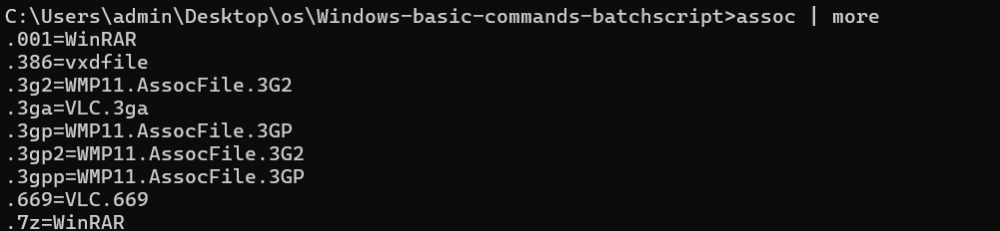

Compare the file hello.txt and rose.txt

## COMMAND AND OUTPUT
```
fc hello.txt Rose.txt
```
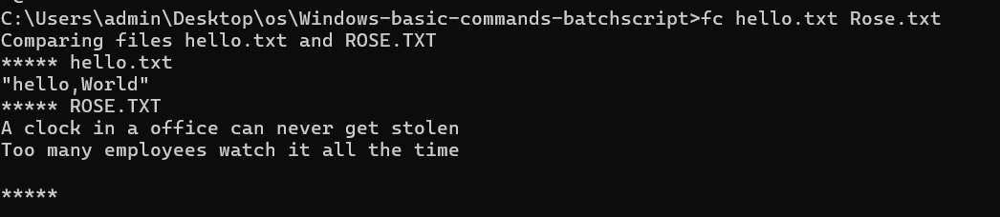


## Exercise 2: Advanced Batch Scripting
Create a batch file named on the desktop. The batch file need to have a variable assigned with a desired name for ex. name="John" and display as "Hello, John".


## OUTPUT


Create a batch file  on the desktop that checks whether a user-input number is odd or not. The script should:
Prompt the user to enter a number.
Calculate the remainder when the number is divided by 2.
Display whether the number is odd or not.
Ask the user if they want to check another number.
Repeat the process if the user enters Y, and exit with a thank-you message if the user enters N.
Handle invalid inputs for the continuation prompt (Y/N) gracefully.


## OUTPUT


Write a batch file that uses a FOR loop to iterate over a sequence of numbers (1 to 5) and displays each number with the label Number:. The output should pause at the end.


## OUTPUT


Write a batch script to check whether a file named sample.txt exists in the current directory. If the file exists, display the message sample.txt exists. Otherwise, display sample.txt does not exist. Pause the script at the end to view the result.

Instructions:
Use the IF EXIST conditional statement.
Make sure the script works for files located in the same directory as the batch file.
Use pause to keep the command window open after displaying the message.
Expected Output (if the file exists):

## OUTPUT
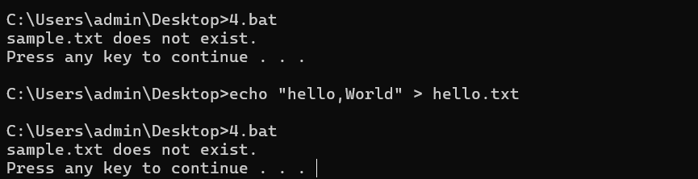

Write a batch script that displays a simple menu with three options:
Say Hello – Displays the message Hello, World!
Create a File – Creates a file named newfile.txt with the content This is a new file
Exit – Exits the script with a goodbye message
The script should repeatedly display the menu until the user chooses to exit. Use goto statements to handle menu navigation.


## OUTPUT
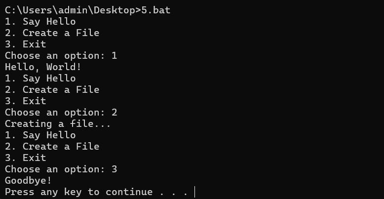


# RESULT:
The commands/batch files are executed successfully.

